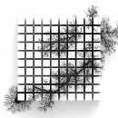

# 🎛️ Generative Tuning



**Generative Tuning** is a meta‑repository of tools and Max for Live devices for exploring *tuning systems, harmonic proportions, and pitch topologies* in real time. It is designed for composers, performers, and artistic researchers who want to **generate, analyze, and perform with alternative harmonic logics** inside Ableton Live and Max/MSP.

The project focuses on **relationships between pitches rather than fixed scales**: ratios, sets, spatial and topological mappings, and algorithmic transformations that can be played, visualized, and sonified in performance.

---

## ✨ What’s inside

This repository collects a growing set of experimental devices and utilities, including:

* **Max for Live tools** for calculating pitch proportions and harmonic sets
* **Generative tuners** that derive frequencies from relationships instead of equal temperament
* **Topology‑based pitch mappers** (grids, networks, and modal spaces)
* **Controllers & performance interfaces** (e.g. Push / keyboard‑based workflows)
* **Analysis utilities** for inspecting harmonic material in real time

It is intended both as a **performance toolkit** and a **research sandbox** for developing and testing new tuning and harmonic concepts.

---

## 🚀 Getting Started

### Requirements

* Ableton Live (with Max for Live)
* Max 8 (standalone recommended for development)
* A MIDI controller (Push, keyboard, or grid controller recommended)

### Installation

1. Clone this repository:

   ```bash
   git clone https://bitbucket.org/AdrianArtacho/generativetuning.git
   ```

2. Open the relevant `.amxd` devices in Ableton Live, or load the Max patches directly in Max for development and modification.

3. Map a MIDI controller (optional but recommended) to explore the pitch spaces interactively.

---

## 🧭 Conceptual Approach

Instead of treating tuning as a static lookup table, **Generative Tuning treats harmony as a dynamic system**:

* Pitches emerge from **ratios and proportions**
* Harmonic structures are represented as **sets and spaces**
* Controllers navigate **topologies** rather than fixed scales

This makes the system well‑suited for:

* Microtonal and just‑intonation experiments
* Polytemporal or distributed performance contexts
* Algorithmic composition and live electronics
* Artistic research in perception, tuning, and harmonic cognition

---

## 🛠️ Development Notes

This repository is structured as a **meta‑workspace** rather than a single polished application. Expect:

* Rapid iteration
* Experimental branches
* Devices in various stages of stability

Contributions, forks, and adaptations for teaching, performance, or research contexts are very welcome.

---

## 📜 License

This project is shared for artistic, educational, and research use. If you plan to use parts of it in a publication or public project, attribution is appreciated.

---

## 📬 Contact

For questions, collaboration, or research exchange, feel free to reach out via:

* [https://www.artacho.at](https://www.artacho.at)

---

## 📌 [To‑Do](https://trello.com/c/9AAhF0FM/89-second-order-harmony)

---

*Generative Tuning is an ongoing exploration of harmony as a living system — navigated, performed, and heard in real time.*
